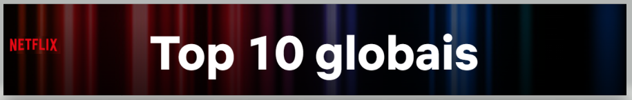

# Datawrapper
Dashboard com Datawrapper

Este simples dashboard foi criado apenas para mostrar a utilização da ferramenta Datawrapper na geração de gráficos interativos e on-line e a possibilidade de criar Dashboards com simples manuseios em HTML5.

Nele foram utilizados alguns dados fornecidos pela Netflix, onde você poderá encontrar dados, que semanalmente são atualizados com os 10 filmes e séries mais
assistidos, distribuidos por pais, lingua, número de horas visualizados, suas posições no ranking, entre outras informações.

Para quem gosta de manipular dados, identificar tendências e insights é um boa oportunidade para estimular a criatividade !!

- Acesse o Dashboard
<html5>

</html5>

  - Fonte de informações
<html5>
		
		
		
</html5>
  
  #### Ferramentas utilizadas:
- Dados tratados com Python
- Geração dos graficos com Datawrapper
- Criação do Dashboard em HTML5
- Site criado em GitHub Pages
